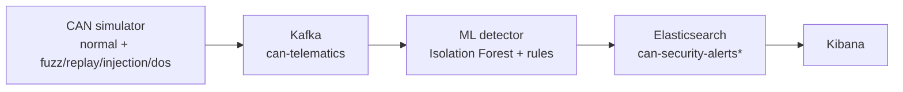

# CAV Security Pipeline

Local cybersecurity monitoring prototype for Connected and Autonomous Vehicle CAN telemetry. The pipeline generates synthetic CAN frames, streams them through Kafka, detects anomalous behavior with machine learning plus explainable security heuristics, indexes enriched events into Elasticsearch, and supports analysis in Kibana.

## Architecture



## Components

| Path | Purpose |
| --- | --- |
| `simulator/can_simulator.py` | Produces normal and attack CAN traffic into Kafka. |
| `detection/ml_detector.py` | Consumes Kafka frames, extracts streaming features, applies anomaly detection, and indexes enriched records. |
| `evaluation/evaluate_detection.py` | Computes TP/TN/FP/FN, precision, recall, F1, false-positive rate, and accuracy from Elasticsearch. |
| `docker-compose.yml` | Runs Zookeeper, Kafka, Elasticsearch, and Kibana locally. |
| `docs/` | Architecture notes, runbook, model evaluation notes, and Kibana guidance. |

## Current Detection Approach

The detector combines:

- Isolation Forest scoring after warmup on stable normal traffic.
- Explainable deterministic security rules for high-confidence CAN attack patterns.
- Streaming replay heuristics based on payload repetition, arbitration-ID transitions, per-ID timing rhythm, and physics/state constraints.

The detector does not rely on replay ground-truth metadata for its current replay rule path.

## Latest Fresh Run

Latest optimized validation report generated on June 15, 2026:

```text
index: can-security-alerts-optimized-20260615
overall precision: 99.99%
overall recall:    80.40%
overall F1:        89.13%
false positive rate: 0.013%
accuracy:          88.31%
```

Per-attack recall:

```text
fuzz:      99.95%
replay:    35.98%
injection: 90.53%
dos:      100.00%
```

Replay detection is the main remaining bottleneck. Earlier simulator-metadata-assisted replay detection produced much higher scores, but the current result is the honest metadata-free baseline.

Generated report files are kept out of Git by default via `.gitignore`; rerun the evaluator to regenerate local reports under `reports/`.

## Quick Start

Create and activate a virtual environment:

```bash
python3 -m venv .venv
source .venv/bin/activate
pip install -r requirements.txt
```

Start infrastructure:

```bash
docker compose up -d
```

Start the detector:

```bash
python detection/ml_detector.py \
  --warmup-samples 1000 \
  --consumer-group cav-security-detector-live \
  --auto-offset-reset latest
```

Generate normal traffic:

```bash
python simulator/can_simulator.py --attack-mode normal --rate-hz 80
```

Generate attack traffic:

```bash
python simulator/can_simulator.py --attack-mode fuzz --rate-hz 20
python simulator/can_simulator.py --attack-mode replay --rate-hz 40
python simulator/can_simulator.py --attack-mode injection --rate-hz 40
python simulator/can_simulator.py --attack-mode dos --rate-hz 10
```

Evaluate:

```bash
python evaluation/evaluate_detection.py \
  --index can-security-alerts \
  --json-out reports/detection-evaluation.json \
  --csv-out reports/detection-evaluation.csv
```

## Services

| Service | URL / Port |
| --- | --- |
| Kafka | `localhost:9092` |
| Elasticsearch | `http://localhost:9200` |
| Kibana | `http://localhost:5601` |

## Future Work

- Improve metadata-free replay recall while keeping false-positive rate below 1%.
- Add arbitration-ID n-gram sequence modeling with calibrated transition thresholds.
- Add per-ID timing profiles with adaptive seasonal baselines.
- Combine stale-state, payload repetition, and ordering evidence into a replay confidence score.
- Add automated repeatable benchmark scripts for normal and all attack modes.
- Add tests for feature extraction, rule firing, and evaluation metric correctness.

## Teardown

Stop local services while preserving generated project files:

```bash
docker compose down
```

Do not use `docker compose down -v` unless you intentionally want to delete local Docker volumes/data.
