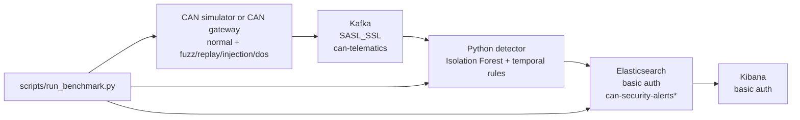

# CAV Security Pipeline

Hardened deployment framework for cybersecurity monitoring of Connected and Autonomous Vehicle CAN telemetry. The system generates or ingests CAN-style frames, streams them through Kafka over authenticated TLS, applies an ensembled machine-learning and rule-based anomaly detector, indexes enriched alerts into authenticated Elasticsearch, and supports operational analysis in Kibana.

## Architecture



## Components

| Path | Purpose |
| --- | --- |
| `simulator/can_simulator.py` | Produces normal and attack CAN traffic into secured Kafka. |
| `detection/ml_detector.py` | Consumes Kafka frames, extracts streaming features, ensembles Isolation Forest and security rules, and indexes enriched events. |
| `evaluation/evaluate_detection.py` | Computes TP/TN/FP/FN, precision, recall, F1, false-positive rate, and accuracy from Elasticsearch. |
| `scripts/run_benchmark.py` | Runs the full local smoke benchmark from service health checks through final evaluation metrics. |
| `scripts/generate-kafka-certs.sh` | Generates local Kafka broker TLS material for SASL_SSL. |
| `docker-compose.yml` | Runs local hardened infrastructure with loopback-only host bindings. |
| `requirements.txt` | Strictly pinned runtime dependencies generated from `requirements.in`. |
| `tests/` | Pytest unit tests for feature extraction, deterministic rules, and replay detection. |

## Security Architecture

### Network Isolation

Docker Compose binds externally reachable service ports to `127.0.0.1` only. Zookeeper is not published to the host and is available only on the internal Compose network. Kafka, Elasticsearch, and Kibana remain reachable for local development and benchmark automation without being exposed on all host interfaces.

### Kafka Transport Security

Kafka is configured for `SASL_SSL` using the `PLAIN` SASL mechanism and locally generated TLS material. The Python simulator, detector, and benchmark runner read connection settings from environment variables:

```bash
KAFKA_BOOTSTRAP_SERVERS=localhost:9092
KAFKA_USER=cav_app
KAFKA_PASSWORD=replace-me
KAFKA_CA_CERT_PATH=.kafka_secrets/kafka.server.cer
```

For staging or production, replace `PLAIN` with an organization-approved SASL mechanism such as SCRAM or mTLS-backed authentication where available, issue certificates from the platform CA, and rotate credentials through the deployment secret manager rather than local files.

### Elastic Stack Authentication

Elasticsearch security is enabled with x-pack basic authentication. Kibana authenticates to Elasticsearch with the `kibana_system` account, and pipeline clients authenticate with environment-provided credentials:

```bash
ELASTICSEARCH_URL=http://localhost:9200
ELASTIC_USER=elastic
ELASTIC_PASSWORD=replace-me
# Set ES_CA_CERT_PATH only when ELASTICSEARCH_URL uses HTTPS.
```

The detector writes structured decision fields including `is_anomaly`, `model_flag`, `rule_flag`, `rule_flags`, and `decision_reasons` so analysts can audit why each record was flagged.

## Detection Engine Specifications

The detector is intentionally ensembled: a single anomaly decision can be produced by either the statistical model or deterministic cyber-physical rules.

### Statistical Point-Anomaly Model

After warmup on stable normal traffic, the detector fits an Isolation Forest over streaming CAN features such as arbitration ID, signal values, rolling interarrival timing, bus frequency, entropy, payload repetition, and priority indicators. During inference, the model emits:

- `model_prediction`: raw Isolation Forest prediction, `-1` for model anomaly and `1` for model normal.
- `anomaly_score`: Isolation Forest decision score.
- `model_flag`: true only when the model reports an anomaly and the score crosses the severe-anomaly threshold.

The severity threshold prevents mild statistical drift from dominating high-confidence deterministic evidence, keeping the false-positive rate controlled.

### Deterministic Security Rules

Rule logic detects high-confidence attack signatures including low-priority ID floods, unknown IDs with raw payloads, impossible speed or acceleration, redline RPM, thermal violations, voltage drops, brake suppression, and physics/state-transition violations.

The final decision is:

```text
is_anomaly = model_flag OR rule_flag
```

Each record keeps both the boolean ensemble decision and the explanation fields, making the detector suitable for operational triage and evaluation.

### Stateful Replay Detection

Replay attacks often reuse valid payload values, which means single-frame statistical detection is weak. The current detector adds per-arbitration-ID temporal memory:

- A rolling payload n-gram buffer tracks short exact payload sequences per arbitration ID.
- A lookup table records repeated n-grams and their recurrence timing.
- Per-ID interarrival baselines provide normal seasonal timing context.
- The replay rule triggers when a repeated valid payload sequence returns with compressed timing or violates learned transition/timing behavior.

Mathematically, the replay signal is a conjunction of sequence recurrence and timing improbability:

```text
payload_sequence_replay_score =
  repeat_evidence + compressed_timing_evidence + timing_anomaly_evidence
```

This lets the detector flag metadata-free replay behavior without relying on simulator-only labels such as `replayed_original_sequence`.

## Production Deployment Runbook

### 1. Prepare Secrets

Create `.env` from the template and replace all placeholder values:

```bash
cp .env.example .env
```

Load secrets for local certificate generation:

```bash
set -a
source .env
set +a
```

Generate local Kafka TLS material:

```bash
./scripts/generate-kafka-certs.sh
```

For staging or production, use platform-managed secrets and CA-issued certificates. Do not commit `.env`, certificates, keystores, truststores, Docker volumes, or generated reports.

### 2. Install Dependencies

```bash
python3 -m venv .venv
source .venv/bin/activate
pip install -r requirements.txt
pip install -r requirements-dev.txt
```

Regenerate pinned dependencies only from `.in` files:

```bash
pip install pip-tools
PIP_TOOLS_CACHE_DIR=/private/tmp/cav-pip-tools-cache pip-compile --resolver=backtracking --strip-extras --output-file requirements.txt requirements.in
PIP_TOOLS_CACHE_DIR=/private/tmp/cav-pip-tools-cache pip-compile --resolver=backtracking --strip-extras --output-file requirements-dev.txt requirements-dev.in
```

Run `pip-compile` under the same Python version used in deployment.

### 3. Start Infrastructure

```bash
docker compose up -d
docker compose ps
```

Expected local endpoints:

| Service | Endpoint |
| --- | --- |
| Kafka | `localhost:9092` over `SASL_SSL` |
| Elasticsearch | `${ELASTICSEARCH_URL}`; local Compose defaults to `http://localhost:9200` with basic auth |
| Kibana | `http://localhost:5601` |

### 4. Run Tests

```bash
python3 -m compileall simulator detection evaluation tests
.venv/bin/python -m pytest
```

### 5. Run End-to-End Benchmark

The automated wrapper prepares local secrets/certificates and synchronizes Docker Compose before running the benchmark:

```bash
./scripts/auto_run_pipeline.sh
```

Pass benchmark arguments through the wrapper:

```bash
./scripts/auto_run_pipeline.sh --normal-seconds 30 --attack-seconds 15
```

To run only the benchmark after the environment and infrastructure are already prepared:

```bash
.venv/bin/python scripts/run_benchmark.py
```

The benchmark runner:

1. Loads `.env`.
2. Verifies Docker Compose service state.
3. Connects to Kafka using `SASL_SSL`.
4. Connects to Elasticsearch using basic authentication, with CA verification when `ELASTICSEARCH_URL` uses HTTPS.
5. Starts the detector against a unique benchmark index.
6. Runs normal warmup traffic, then fuzz, replay, injection, and DoS traffic.
7. Runs the evaluator and prints final precision, recall, F1, false-positive rate, accuracy, and per-attack recall.

Reports are written under `reports/`.

### 6. Manual Runtime Commands

Start detector:

```bash
source .venv/bin/activate
set -a
source .env
set +a

python detection/ml_detector.py \
  --warmup-samples 1000 \
  --consumer-group cav-security-detector-live \
  --auto-offset-reset latest
```

Generate traffic:

```bash
python simulator/can_simulator.py --attack-mode normal --rate-hz 80
python simulator/can_simulator.py --attack-mode fuzz --rate-hz 40
python simulator/can_simulator.py --attack-mode replay --rate-hz 40
python simulator/can_simulator.py --attack-mode injection --rate-hz 40
python simulator/can_simulator.py --attack-mode dos --rate-hz 10
```

Evaluate:

```bash
python evaluation/evaluate_detection.py \
  --index 'can-security-alerts*' \
  --json-out reports/detection-evaluation.json \
  --csv-out reports/detection-evaluation.csv
```

### 7. Operational Hardening Checklist

- Use managed Kafka and Elasticsearch in live environments where possible.
- Replace local `PLAIN` SASL credentials with SCRAM, OAuth, or mTLS according to platform policy.
- Store secrets in a secret manager and inject them as environment variables at runtime.
- Use CA-issued certificates and enable strict TLS verification for every client.
- Configure index lifecycle management for alert indices.
- Export detector logs and metrics to the platform observability stack.
- Run `scripts/run_benchmark.py` in CI against an ephemeral staging stack before release.
- Track replay recall and false-positive rate as release gates.

## Teardown

Stop local services while preserving local volumes:

```bash
docker compose down
```

Only remove volumes when intentionally deleting local Kafka and Elasticsearch data:

```bash
docker compose down -v
```
