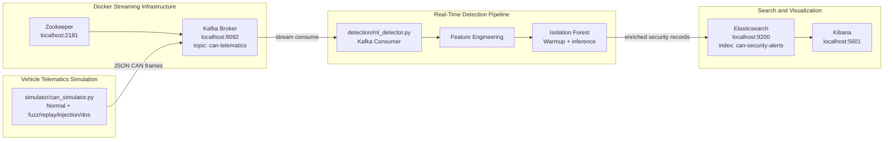
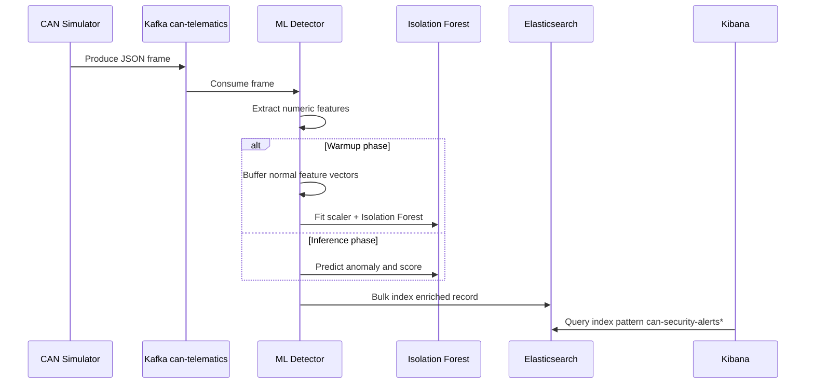
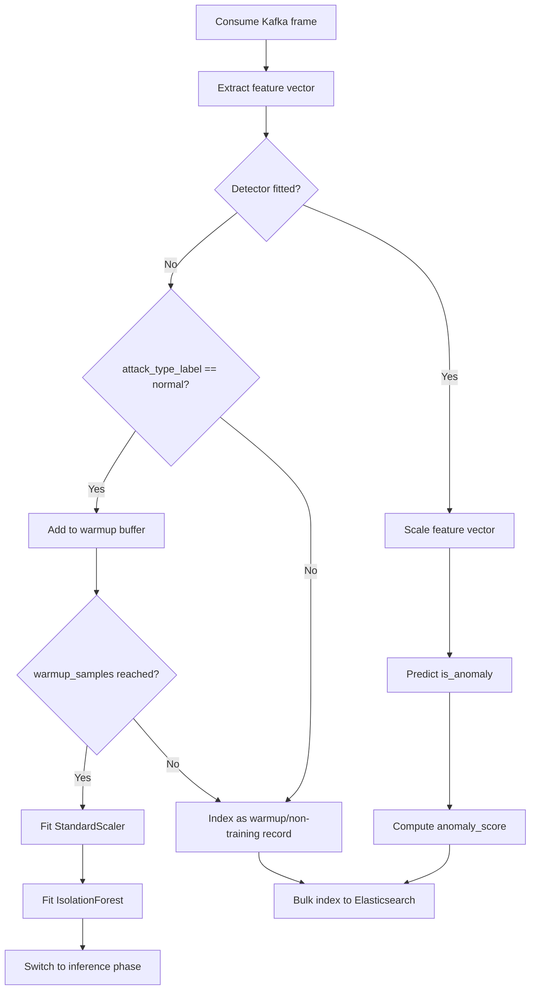

# CAV Cybersecurity Pipeline Architecture

This project is a local, production-shaped prototype for monitoring Connected Autonomous Vehicle telemetry. It generates synthetic CAN bus frames, streams them through Kafka, performs real-time anomaly detection with an Isolation Forest model, and indexes enriched security events into Elasticsearch for Kibana exploration.

## System Architecture



## Repository Layout

```text
cav-security-pipeline/
├── .gitignore
├── requirements.txt
├── docker-compose.yml
├── docs/
│   ├── architecture.md
│   └── runbook.md
├── simulator/
│   ├── __init__.py
│   └── can_simulator.py
└── detection/
    ├── __init__.py
    └── ml_detector.py
```

Local runtime directories such as `.venv/`, `.es_data/`, `.kafka_data/`, `.zookeeper_data/`, and `__pycache__/` are intentionally excluded from source control.

## File Responsibilities

| File | Responsibility |
| --- | --- |
| `.gitignore` | Keeps virtual environments, Python cache files, environment files, and local Docker data out of Git. |
| `requirements.txt` | Defines Python dependencies for Kafka access, machine learning, Elasticsearch indexing, and numeric processing. |
| `docker-compose.yml` | Starts Zookeeper, Kafka, Elasticsearch, and Kibana as the local streaming and analytics stack. |
| `simulator/can_simulator.py` | Produces realistic vehicle CAN telemetry and attack traffic into Kafka. |
| `detection/ml_detector.py` | Consumes Kafka frames, extracts features, trains the Isolation Forest during warmup, performs inference, and indexes enriched records into Elasticsearch. |
| `evaluation/evaluate_detection.py` | Computes repeatable TP/TN/FP/FN and precision/recall/F1 metrics from Elasticsearch records. |
| `docs/architecture.md` | Explains system design, data flow, feature engineering, and visualization usage. |
| `docs/runbook.md` | Provides exact commands to start, verify, operate, and troubleshoot the project. |

## Data Flow



## Kafka Producer Flow

`simulator/can_simulator.py` is the Kafka producer.

1. The simulator starts from CLI arguments such as `--attack-mode`, `--rate-hz`, `--topic`, and `--bootstrap-servers`.
2. It creates a `KafkaProducer` connected to `localhost:9092`.
3. It continuously updates a synthetic vehicle state at the configured rate.
4. It emits JSON records to the `can-telematics` topic.
5. The message key is derived from vehicle and arbitration metadata so related frames are distributed predictably.
6. The producer flushes periodically and again during graceful shutdown.

Every emitted record includes fields such as:

```text
timestamp
event_time_epoch_ms
simulator_send_time_ns
vehicle_id
session_id
sequence
arbitration_id
dlc
payload
attack_type_label
```

## Simulator Traffic Modes

| Mode | Behavior | Security Purpose |
| --- | --- | --- |
| `normal` | Emits coherent engine, brake, speed, steering, and coolant frames. | Creates baseline driving telemetry. |
| `fuzz` | Emits high-frequency random arbitration IDs and randomized payloads. | Simulates malformed or chaotic CAN traffic. |
| `replay` | Captures normal traffic into a buffer and repeatedly replays it. | Simulates replay of previously valid traffic. |
| `injection` | Adds targeted anomalous values, such as speed spikes or brake suppression. | Simulates malicious manipulation of safety-critical signals. |
| `dos` | Floods the bus with zeroed payloads on dominant arbitration ID `0x000`. | Simulates bus saturation and priority abuse. |

## Kafka Consumer Flow

`detection/ml_detector.py` is the Kafka consumer and stream processor.

1. It creates a `KafkaConsumer` for the `can-telematics` topic.
2. It deserializes each Kafka message from JSON into a Python dictionary.
3. It extracts numeric model features from the CAN frame and payload.
4. During warmup, it collects normal-labeled frames until `--warmup-samples` is reached.
5. After warmup, it fits a `StandardScaler` and `IsolationForest`.
6. During inference, it predicts each incoming frame as normal or anomalous.
7. It adds detection metadata.
8. It writes processed records to Elasticsearch with bulk indexing.

The detector supports `--auto-offset-reset latest`, which is useful for live testing because the detector starts from newly arriving Kafka messages instead of replaying old topic history.

## Feature Engineering

The model input is a fixed numeric vector created from each CAN frame. Current feature groups include:

| Feature Group | Examples |
| --- | --- |
| CAN identity | `arbitration_id_numeric` |
| Vehicle dynamics | `rpm`, `speed`, `brake_pressure`, `acceleration`, `gear` |
| Engine and thermal state | `coolant_temp`, `engine_load`, `throttle_position` |
| Chassis and ADAS | `wheel_speed_fl`, `wheel_speed_fr`, `steering_angle`, `yaw_rate`, `abs_active`, `lane_assist_active` |
| Electrical/environment | `battery_voltage`, `ambient_temp` |
| Raw payload statistics | `raw_byte_mean`, `raw_byte_std` |
| Timing/frequency | `interarrival_ms`, `id_frequency_1s`, `bus_frequency_1s` |
| DoS traffic shape | `id_entropy_1s`, `dominant_id_ratio`, `bus_utilization`, `repeated_id_ratio`, `payload_repeat_ratio` |
| CAN priority context | `reserved_id_flag`, `arbitration_priority_score`, `unique_ids_per_second` |

Feature engineering is intentionally broader than the visible payload fields. This gives the detector context about message timing and traffic volume, not just individual signal values.

## Isolation Forest Training Flow



During warmup, normal records are used to learn baseline behavior. Once the warmup window is complete, all incoming records are scored. The resulting fields include:

```text
is_anomaly
anomaly_score
attack_type_label
detector_phase
detector_timestamp
pipeline_latency_ms
features.*
```

`is_anomaly` follows scikit-learn Isolation Forest semantics:

| Value | Meaning |
| --- | --- |
| `1` | Model considers the record normal. |
| `-1` | Model considers the record anomalous. |

## Elasticsearch Indexing Flow

The detector writes to `can-security-alerts` by default.

1. On startup, the detector connects to `http://localhost:9200`.
2. It creates the target index if it does not exist.
3. It defines mappings for timestamps, keyword fields, numeric telemetry, feature values, anomaly status, score, and latency.
4. It batches records in memory.
5. It uses the Elasticsearch bulk helper to reduce indexing overhead.

Useful index patterns:

```text
can-security-alerts*
can-security-alerts-e2e*
```

## Kibana Usage Flow

1. Open Kibana at `http://localhost:5601`.
2. Create a data view for `can-security-alerts*`.
3. Use `timestamp` as the time field.
4. Open Discover.
5. Set the time picker to a range that includes the test run.
6. Use KQL filters such as:

```text
attack_type_label: "injection"
is_anomaly: -1
attack_type_label: "fuzz" and is_anomaly: -1
detector_phase: "inference"
```

Recommended fields to add in Discover:

```text
timestamp
vehicle_id
arbitration_id
attack_type_label
is_anomaly
anomaly_score
pipeline_latency_ms
payload.speed
payload.brake_pressure
payload.rpm
features.bus_frequency_1s
features.id_frequency_1s
```
